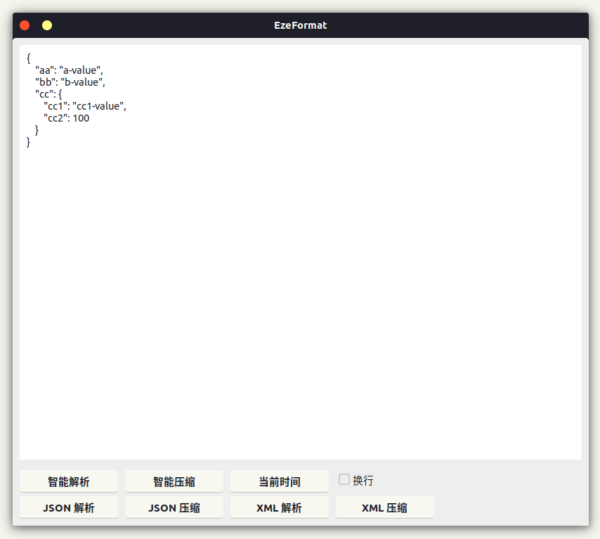
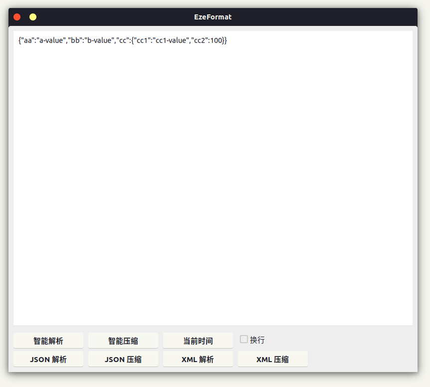
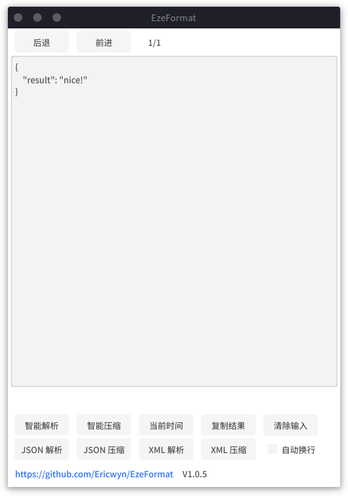

# EzeJson
一款平平无奇的格式化工具

- 使用 go + gtk3 实现

- linux 下支持获取划词 (需安装 xclip )

| JSON 格式化                     | JSON 压缩                      | 日期处理                         |
|------------------------------|------------------------------|------------------------------|
|  |  |  |

可搭配 [fastray](https://github.com/Ericwyn/fastray) 项目来实现 appTray 处快捷启动

## 支持
- JSON
- XML
- 时间
  - 秒/毫秒时间戳
  - yyyy-MM-dd
  - yyyy-MM-dd HH:mm
  - yyyy-MM-dd HH:mm:ss
  - yyyy-MM-dd HH:mm:ss.SSS

支持自动识别输入的数据格式

## TODO
- SQL 格式化
  - ? 参数填入代码格式化