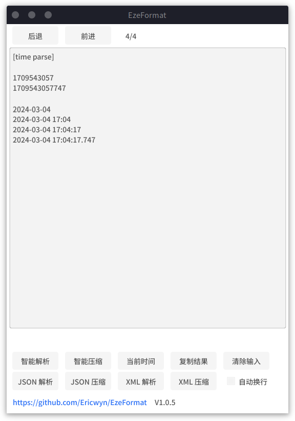

# EzeJson

一款平平无奇(但很好用)的格式化工具

| JSON 格式化                     | JSON 压缩                      | 日期处理                         |
|------------------------------|------------------------------|------------------------------|
|  |  |  |

可搭配 [fastray](https://github.com/Ericwyn/fastray) 项目来实现 appTray 处快捷启动

## Feature
- 纯 Golang 实现, 轻便小巧
- 支持划词获取（Linux 下可用，依赖 xclip），使用 `-x` 命令启动
- 支持自动识别输入的数据格式
  - JSON
  - XML
  - 时间
    - 秒/毫秒时间戳
    - yyyy-MM-dd
    - yyyy-MM-dd HH:mm
    - yyyy-MM-dd HH:mm:ss
    - yyyy-MM-dd HH:mm:ss.SSS
- 支持查看历史

## TODO
- SQL 格式化
  - ? 参数填入代码格式化
